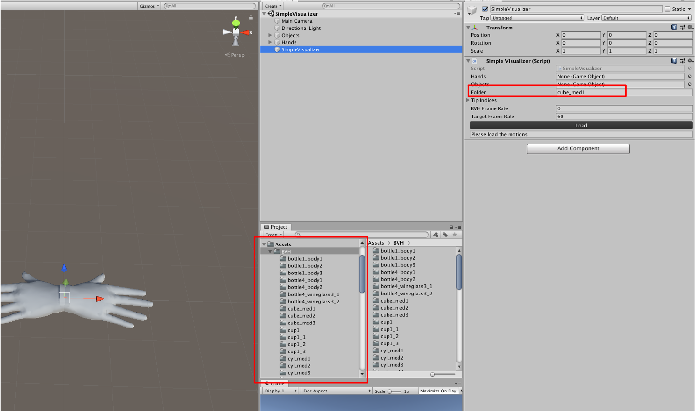

Data & SimpleVisualizer
============

Data 
------------

  1. bvh motion files <a href="https://github.com/cghezhang/ManipNet/tree/main/Data/BVH">BVHs</a>;

  2. object models (OBJ files) <a href="https://github.com/cghezhang/ManipNet/tree/main/Data/ObjectModel">OBJs</a>;

  3. hand model (Unity Prefab) <a href="https://github.com/cghezhang/ManipNet/tree/main/Data/HandModel/UnityPrefab">HandModel</a>;

SimpleVisualizer 
------------

  1. Open <a href="https://github.com/cghezhang/ManipNet/tree/main/Data/SimpleVisualizer">SimpleVisualizer</a> with Unity;

  2. Type in the Folder name (shown in right top (red) box) and press Load;

  3. Folder name can be either the full path or folder name inside Asset/BVH (shown in middle bottom (red) box);

