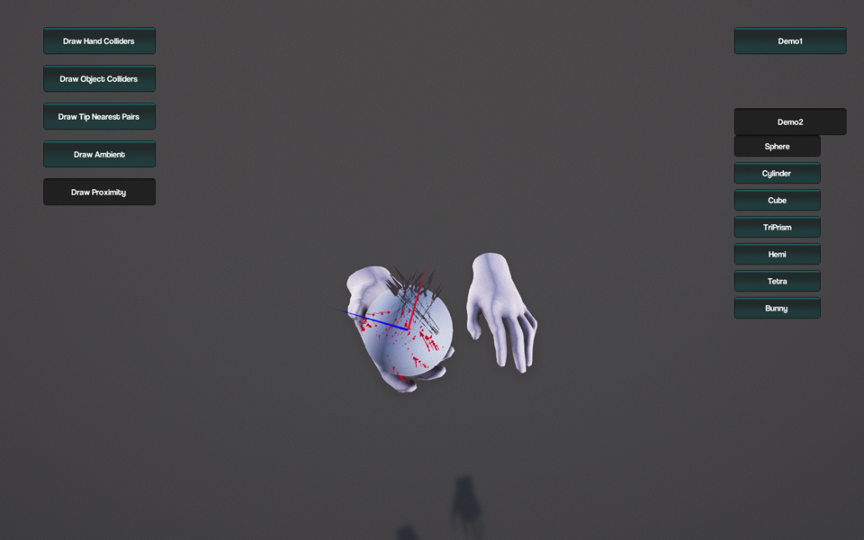

Demo
============

  1. Please download here: https://drive.google.com/drive/folders/10vK6wHWKryUUTyESCtKwVH9ygCq5n4MD?usp=sharing; 

  2. Windows - run Windows/ManipNetApp/ManipNet.exe; 
  3. Mac - run Mac/ManipNet(.app);

  4. Left-side buttons can control the visualization of different components; 
  5. Right-side buttons can switch two simple demos;

  6. Demo1 shows the result on testing trajectories; 
  7. Demo2 shows different objects with the same trajectories input;

